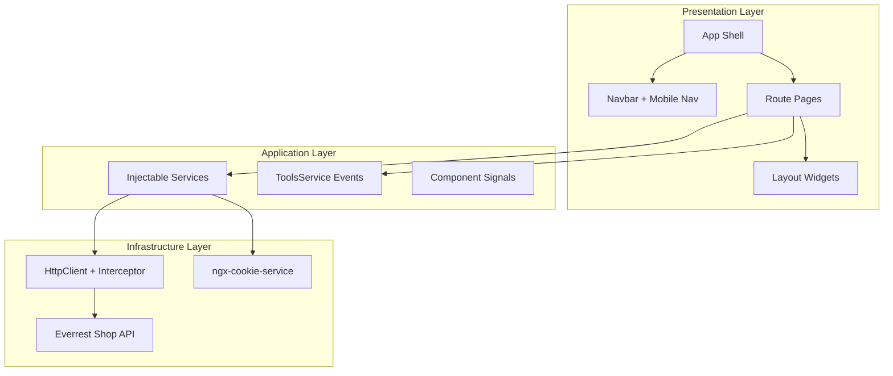

# SHOPPING MALL — High-Level Architecture

Angular 20 standalone e-commerce storefront aligned with the premium dark + gold UI system.

## System Overview



## Layer Responsibilities

| Layer | Location | Responsibility |
|--------|----------|----------------|
| **Shell** | `app.component`, `navbar`, `footer`, `layout/mobile-nav` | Global chrome, navigation, responsive breakpoints |
| **Features** | `home`, `shop`, `cart`, `profile-page`, `sign-in` | Route-level screens and user flows |
| **Layout** | `layout/feature-bar`, `category-grid`, `home-sidebar` | Reusable home sections matching the UI mockup |
| **Core services** | `services/*` | API access, cart, products, shared pub/sub |
| **Contracts** | `interfaces/*` | TypeScript models for API payloads |
| **Cross-cutting** | `api-heads.interceptor.ts` | Auth headers on every HTTP call |

## Routing

| Path | Component | Purpose |
|------|-----------|---------|
| `/` | `HomeComponent` | Hero, features, categories, best sellers, cart sidebar |
| `/shop` | `ShopComponent` | Catalog, filters, pagination |
| `/details/:id` | `DetailsComponent` | Product detail + related items |
| `/cart` | `CartComponent` | Full cart management + checkout |
| `/profile` | `ProfilePageComponent` | User profile (authenticated) |

All routes are eagerly loaded today; lazy loading can be added per feature without changing the public API of services.

## State Management Strategy

The project uses **Angular signals** (local UI state) and **RxJS Subjects** in `ToolsService` for cross-component events (search query, category selection, auth modals)—not NgRx. This keeps the codebase small while remaining scalable:

- **Server state**: loaded in components via services (`ProductsAreaService`, `CartAreaService`)
- **Session state**: cookies (`user`, `userInfo`) + interceptor
- **Ephemeral UI**: signals on feature components (`categories`, loading flags)

## UI Libraries

| Library | Usage |
|---------|--------|
| **Angular Material** | Sign-in / Sign-up modals (`mat-form-field`, `mat-card`, `mat-radio`) |
| **PrimeNG** | Storefront UI: cards, buttons, rating, paginator, toast, dialog, tags |
| **PrimeIcons** | Icon set for PrimeNG components |

Configuration:

- Material theme: `src/theme/material-theme.scss` (dark + yellow primary)
- PrimeNG preset: `src/theme/prime-theme.ts` (gold primary on Lara, `.app-dark`)

## Design System

Global tokens live in `src/styles.css`:

- Background: `#0a0a0a` / `#121212`
- Surface cards: `#1a1a1a`
- Accent gold: `#d4af37`
- Typography: Inter (UI), Playfair Display (headings)

Utility classes: `.btn-gold`, `.btn-ghost`, `.eyebrow`, `.container`.

## Responsive Behavior

| Breakpoint | Behavior |
|------------|----------|
| `> 1100px` | Home: main column + sticky cart sidebar (320px) |
| `≤ 1100px` | Sidebar stacks above products; shop filter sidebar stacks |
| `≤ 900px` | Fixed bottom mobile nav; hamburger menu; body bottom padding |
| `≤ 520px` | Single-column product grids |

## External API

Base: `https://api.everrest.educata.dev/shop`

- Products, categories, filters → `ProductsAreaService`
- Cart CRUD, checkout → `CartAreaService`
- Profile → `ApiAreaService`

## Extension Points

1. **Lazy routes**: split `shop`, `cart`, `profile` into `loadComponent` entries in `app.routes.ts`
2. **Shared product card**: extract from `several-products` and `shop` for one card component
3. **Route guards**: protect `/profile` and checkout using cookie + `CanActivateFn`
4. **Wishlist**: wire heart buttons to a new service endpoint when available

## Folder Structure (target)

```
src/app/
├── layout/          # Reusable UI blocks (feature-bar, sidebar, mobile-nav)
├── home/            # Landing feature
├── shop/            # Catalog + details
├── cart/
├── navbar/ footer/
├── services/        # API & app events
├── interfaces/
└── app.routes.ts
```
